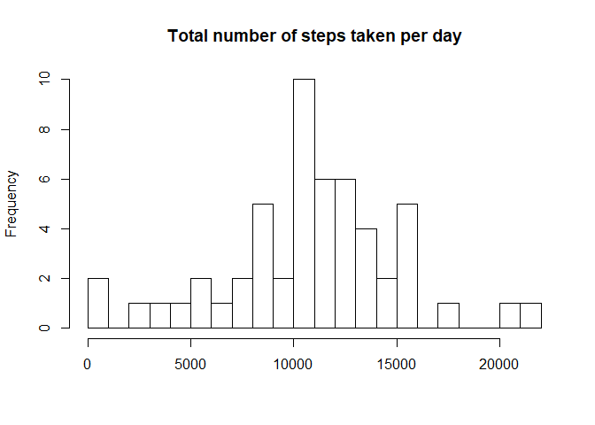
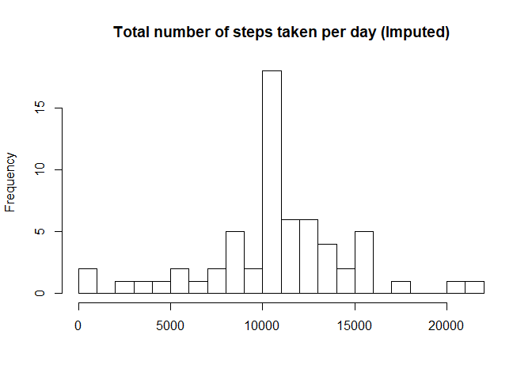
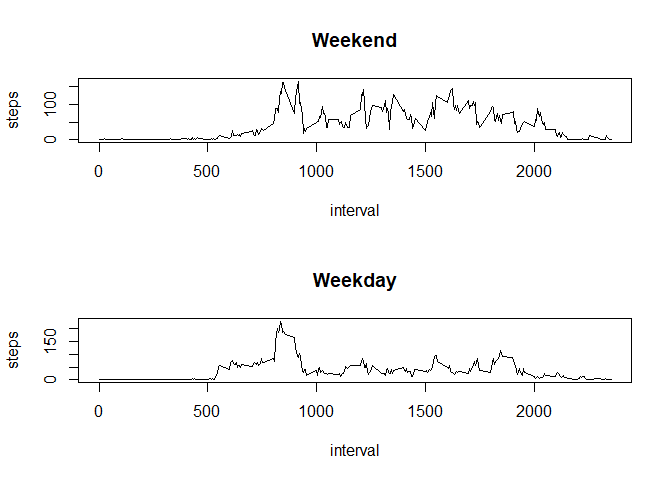

# Reproducible Research: Peer Assessment 1

This assignment makes use of data from a personal activity monitoring device. This device collects data at 5 minute intervals through out the day. The data consists of two months of data from an anonymous individual collected during the months of October and November, 2012 and include the number of steps taken in 5 minute intervals each day.


## Loading and preprocessing the data

Skip downloading if there exists same file, then read it into data frame, x


```r
setwd("d:\\lomolith\\GoogleDrive\\coursera\\DS_5\\Proj1")
url="https://d396qusza40orc.cloudfront.net/repdata%2Fdata%2Factivity.zip"
filename="activity"
  
if(!file.exists(paste0(filename,".zip")))   download.file(url, paste0(filename,".zip"))
x <- read.csv(unz(paste0(filename,".zip"), paste0(filename,".csv")))
```

## What is mean total number of steps taken per day?

For this part of the assignment, we will ignore the missing values in the dataset.
- Draw histogram of steps through all days
- calculate mean/median of steps per day.


```r
x_filtered<-x[!is.na(x$steps),]
steps_per_day<-aggregate(steps~date, x, sum)

hist(steps_per_day$steps, main="Total number of steps taken per day", xlab="", breaks=20)
```

<!-- -->

```r
steps_mean<-mean(steps_per_day$steps)
steps_median<-median(steps_per_day$steps)
print(paste("Mean   of the total number of steps:", steps_mean))
```

```
## [1] "Mean   of the total number of steps: 10766.1886792453"
```

```r
print(paste("Median of the total number of steps:", steps_median))
```

```
## [1] "Median of the total number of steps: 10765"
```


## What is the average daily activity pattern?

Make a time series plot of the 5-min interval and the average number of steps across all days.
- Find the interval contains the maximum number of steps


```r
steps_average_per_interval<-aggregate(steps~interval, x, mean)
plot(steps_average_per_interval, type="l")
```

<!-- -->

```r
row_max<-which.max(steps_average_per_interval$steps)
print(paste0("Interval of the maximum steps - Interval:",
             steps_average_per_interval$interval[row_max]," / Steps:",
             steps_average_per_interval$steps[row_max]
             ))
```

```
## [1] "Interval of the maximum steps - Interval:835 / Steps:206.169811320755"
```

## Imputing missing values

Fill the missing values (NA)
- Calculate average number of steps per interval across all days and apply them on the NA


```r
steps_na<-x[is.na(x$steps),c("date","interval")]
steps_na<-merge(x[is.na(x$steps),c("date","interval")], steps_average_per_interval, by="interval")
steps_nona<-x[!is.na(x$steps),]

steps_filled<-rbind(steps_na, steps_nona)
steps_filled_per_day<-aggregate(steps~date, steps_filled, sum)

hist(steps_filled_per_day$steps, main="Total number of steps taken per day (Imputed)", xlab="", breaks=20)
```

<!-- -->

```r
steps_filled_mean=mean(steps_filled_per_day$steps)
steps_filled_median=median(steps_filled_per_day$steps)
print(paste("Mean   of the total number of steps(Imputed):", steps_filled_mean))
```

```
## [1] "Mean   of the total number of steps(Imputed): 10766.1886792453"
```

```r
print(paste("Median of the total number of steps(Imputed):", steps_filled_median))
```

```
## [1] "Median of the total number of steps(Imputed): 10766.1886792453"
```

```r
print(paste("Impact of imputing missing data - Mean:",abs(steps_mean-steps_filled_mean),"/", "Median:",abs(steps_median-steps_filled_median)))
```

```
## [1] "Impact of imputing missing data - Mean: 0 / Median: 1.1886792452824"
```
  
**Result**: Imputed values **change** the mean and median **very little**.


## Are there differences in activity patterns between weekdays and weekends?

Find activity differences between weekdays and weekends
- Generate a time series plot


```r
library(dplyr)
```

```
## 
## Attaching package: 'dplyr'
```

```
## The following objects are masked from 'package:stats':
## 
##     filter, lag
```

```
## The following objects are masked from 'package:base':
## 
##     intersect, setdiff, setequal, union
```

```r
Sys.setlocale(category="LC_TIME", locale="English")
```

```
## [1] "English_United States.1252"
```

```r
steps_filled$date<-as.Date(steps_filled$date)
steps_filled$daytype<-weekdays(steps_filled$date)

steps_filled_weekend<-filter(steps_filled, daytype=='Sunday' | daytype=='Saturday')
steps_filled_weekday<-filter(steps_filled, daytype!='Sunday', daytype!='Saturday')

steps_average_per_interval_weekend<-aggregate(steps~interval, steps_filled_weekend, mean)
steps_average_per_interval_weekday<-aggregate(steps~interval, steps_filled_weekday, mean)
par(mfrow=c(2,1))
plot(steps_average_per_interval_weekend, type="l", main="Weekend")
plot(steps_average_per_interval_weekday, type="l", main="Weekday")
```

<!-- -->

**Result**: You can see the **average pattern of weekend is much higher** than the weekday

